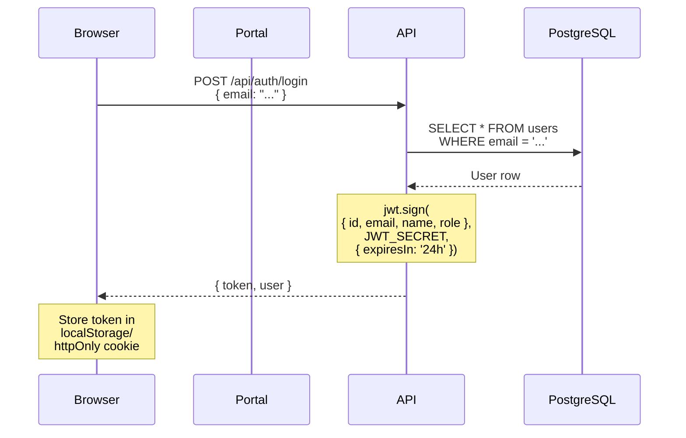
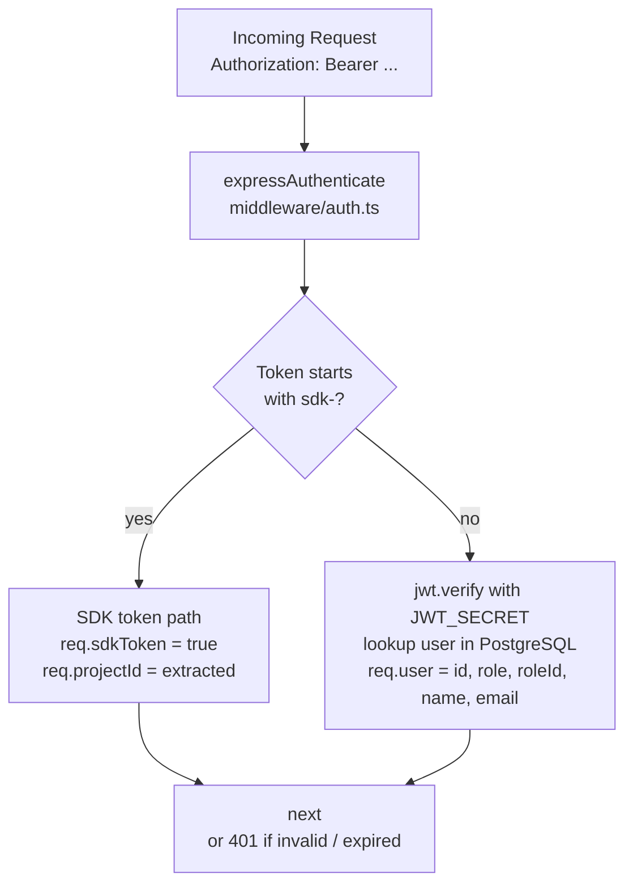
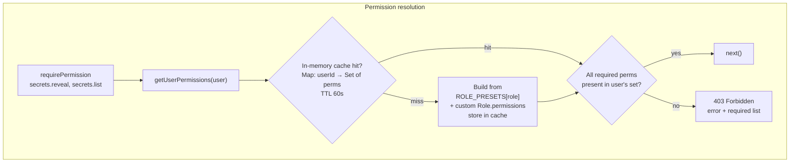
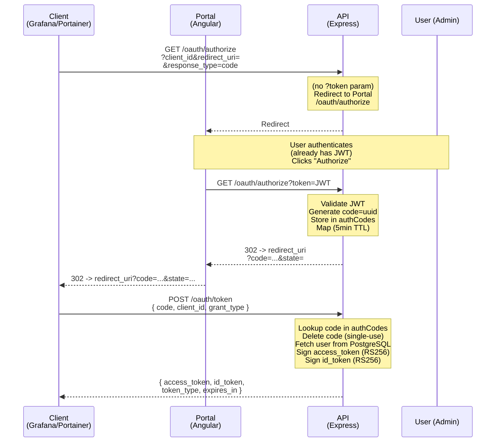
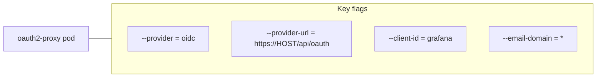

# Authentication Flow

## Login Flow (Email-only)



**Code** (`src/routes/auth.ts:38-59`):
```typescript
router.post('/auth/login', async (req, res) => {
  const { email } = req.body;
  const user = await ds.getRepository(User).findOne({ where: { email } });
  if (!user) return res.status(401).json({ error: 'User email not found' });

  user.lastLogin = new Date();
  await ds.getRepository(User).save(user);

  const token = jwt.sign(
    { id: user.id, email: user.email, name: user.name, role: user.role },
    JWT_SECRET,
    { expiresIn: '24h' }
  );
  return res.json({ token, user });
});
```

**Key characteristics:**
- No password — email lookup only
- Demo users seeded on empty DB: admin@pratyushes.dev, john@pratyushes.dev, sarah@pratyushes.dev, devops@pratyushes.dev
- JWT payload: `{ id, email, name, role }` — no secrets

## JWT Middleware



**Code** (`src/middleware/auth.ts:64-97`):
```typescript
export async function expressAuthenticate(req, res, next) {
  const auth = req.headers.authorization;
  if (!auth?.startsWith('Bearer ')) {
    return res.status(401).json({ error: 'Unauthorized: Missing token' });
  }
  const token = auth.substring(7);

  // SDK token passthrough
  if (token.startsWith('sdk-')) {
    (req as AuthenticatedRequest).sdkToken = true;
    (req as AuthenticatedRequest).projectId = token.split(':')[0].replace('sdk-', '');
    return next();
  }

  // Standard JWT
  try {
    const decoded = jwt.verify(token, JWT_SECRET);
    const user = await ds.getRepository(User).findOne({ where: { id: decoded.id } });
    if (!user) return res.status(401).json({ error: 'Unauthorized: User not found' });
    (req as AuthenticatedRequest).user = { id: user.id, role: user.role, roleId: user.roleId, name: user.name, email: user.email };
    next();
  } catch {
    return res.status(401).json({ error: 'Unauthorized: Invalid or expired token' });
  }
}
```

## RBAC — Role-Based Access Control



### Predefined Roles (`src/config/permissions.ts`)

| Role | Key Permission Highlights |
|------|--------------------------|
| **admin** | All permissions (`Object.keys(PERMISSIONS)`) |
| **devops** | Full: users CRUD, projects, deployments, secrets (reveal/export/import/rollback), cluster management, SMTP, CI/CD, audit |
| **tech_lead** | Administrative: list users, manage projects, deployments (trigger/rollback), secrets (reveal/export/import), manage config, alerts |
| **developer** | Limited: read profile, list/read projects, trigger deployments, read config, alerts, logs, metrics |
| **viewer** | Read-only: list/read projects, read deployments, logs, metrics |

> Note: System roles (`isSystem: true`) cannot be modified or deleted.

### Permission Caching

```typescript
// src/middleware/auth.ts
const permCache = new Map<string, { permissions: Set<string>; expiresAt: number }>();
const PERMISSION_CACHE_TTL_MS = 60_000;

export async function getUserPermissions(user): Promise<Set<string>> {
  const cached = permCache.get(user.id);
  if (cached && cached.expiresAt > Date.now()) return cached.permissions;

  const perms = new Set<string>();
  const preset = ROLE_PRESETS[user.role];
  if (preset) for (const p of preset) perms.add(p);
  if (user.roleId) {
    const role = await ds.getRepository(Role).findOne({ where: { id: user.roleId } });
    if (role?.permissions) for (const p of role.permissions) perms.add(p);
  }
  permCache.set(user.id, { permissions: perms, expiresAt: Date.now() + PERMISSION_CACHE_TTL_MS });
  return perms;
}
```

Cache invalidation triggers:
| Action | Effect |
|--------|--------|
| Role assignment changed (`PATCH /users/:id/role`) | `clearPermissionCache(userId)` |
| Role permissions updated (`PUT /roles/:id`) | `clearPermissionCache(u.id)` for all affected users |
| Role deleted (`DELETE /roles/:id`) | `clearPermissionCache(u.id)` for all assigned users |
| `clearPermissionCache()` with no args | Clears entire cache |

## OIDC Flow (`/oauth/*`)



### OIDC Endpoints

| Endpoint | Method | Description |
|----------|--------|-------------|
| `/api/oauth/.well-known/openid-configuration` | GET | OIDC discovery document |
| `/api/oauth/jwks` | GET | RS256 public key in JWK format |
| `/api/oauth/authorize` | GET | Authorization endpoint (redirects to Portal if no token) |
| `/api/oauth/token` | POST | Token exchange (authorization code → access_token + id_token) |
| `/api/oauth/userinfo` | GET | Userinfo endpoint (requires access_token) |

### Token Details

**RSA keypair** — dynamically generated at API startup (`src/routes/auth.ts:15-29`):
```typescript
const { privateKey, publicKey } = crypto.generateKeyPairSync('rsa', {
  modulusLength: 2048,
  publicKeyEncoding: { type: 'spki', format: 'pem' },
  privateKeyEncoding: { type: 'pkcs8', format: 'pem' }
});
```

**access_token** (RS256, 1h expiry):
```json
{
  "id": "user-uuid",
  "email": "admin@pratyushes.dev",
  "name": "Admin",
  "role": "admin",
  "iss": "https://{host}/api/oauth",
  "aud": "{client_id}"
}
```

**id_token** (RS256, 1h expiry):
```json
{
  "iss": "https://{host}/api/oauth",
  "sub": "user-uuid",
  "aud": "{client_id}",
  "name": "Admin",
  "email": "admin@pratyushes.dev",
  "email_verified": true,
  "groups": ["admin"],
  "roles": ["admin"]
}
```

### OAuth2 Proxy for Grafana/Portainer SSO



Setup in `install-oauth2-proxy.sh`:
- OAuth2 Proxy sits in front of Grafana/Portainer
- Redirects unauthenticated users to `/api/oauth/authorize`
- After successful auth, Proxy validates id_token and sets `X-Forwarded-User` / `X-Email` headers
- Grafana/Portainer configured with `auth.proxy.enabled = true`

## Audit Logging

Every auth-sensitive action is logged to the `audit_logs` PostgreSQL table:

```typescript
await logAudit({
  userId: req.user?.id,
  action: 'secrets.reveal',  // dotted verb hierarchy
  targetType: 'Secret',
  targetId: secret.id,
  metadata: { key, environmentId },
  ip: req.ip,
});
```

**Audit action patterns:**
| Pattern | Examples |
|---------|----------|
| `{noun}.{verb}` | `user.created`, `user.updated`, `user.deleted`, `user.invited`, `user.role-updated` |
| `{noun}.{verb}` | `role.created`, `role.updated`, `role.deleted` |
| `{noun}.{verb}` | `secrets.create`, `secrets.update`, `secrets.delete`, `secrets.reveal`, `secrets.export`, `secrets.import`, `secrets.rollback` |

**Schema** (`src/entities/AuditLog.ts`):
```typescript
@Entity('audit_logs')
export class AuditLog {
  id: string;             // UUID
  userId: string | null;  // actor
  action: string;         // e.g. "user.role-updated"
  targetType: string | null; // e.g. "User"
  targetId: string | null;   // UUID of affected entity
  metadata: Record<string, unknown> | null; // JSONB — arbitrary payload
  ipAddress: string | null;
  performedAt: Date;      // default: CURRENT_TIMESTAMP
}
```
