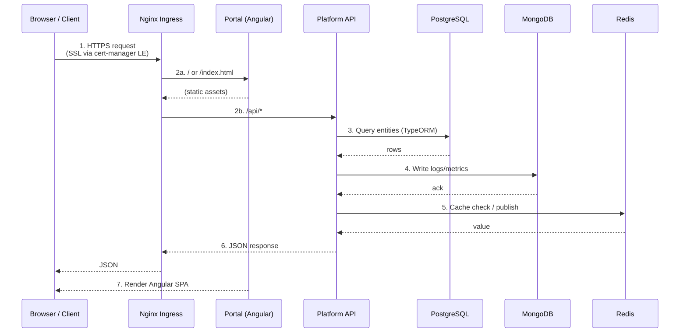
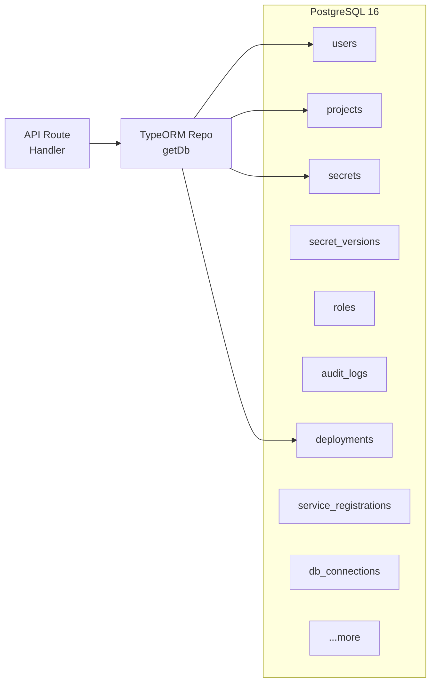
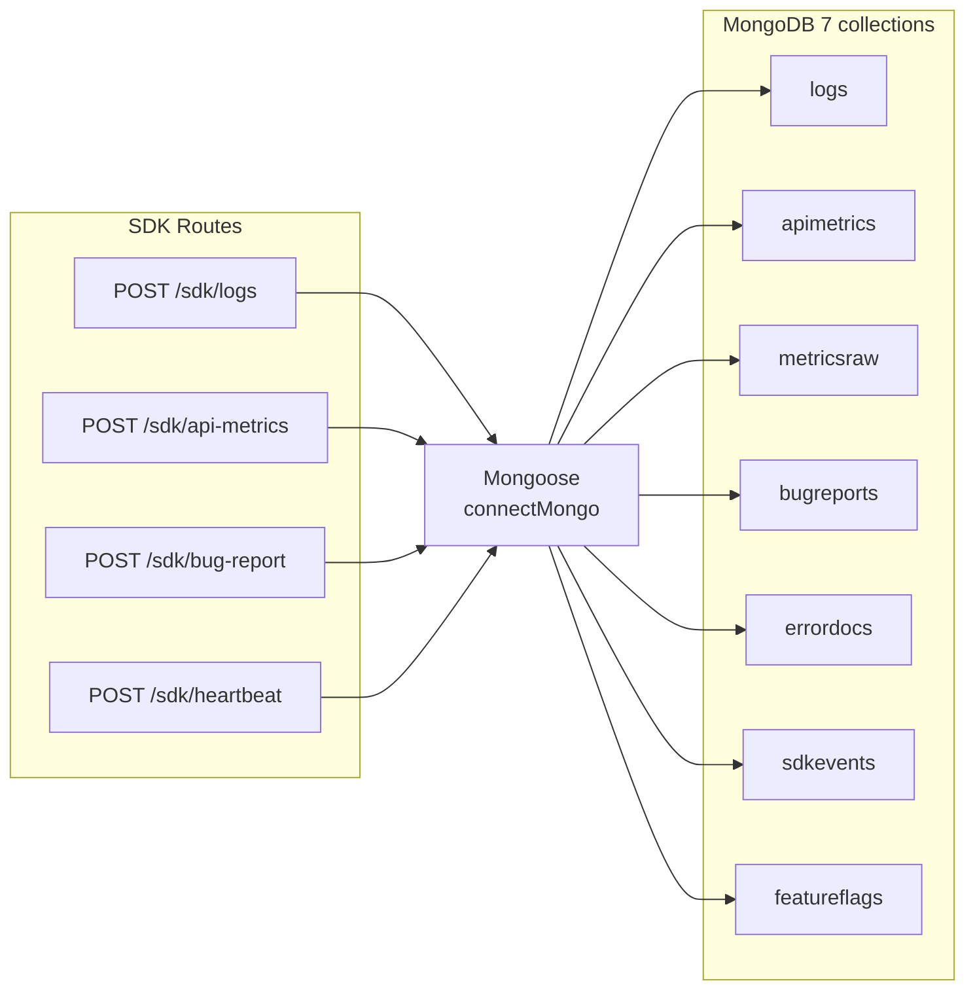
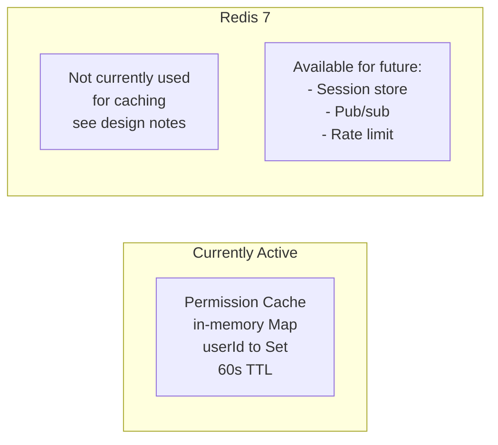
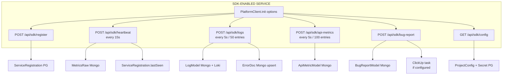
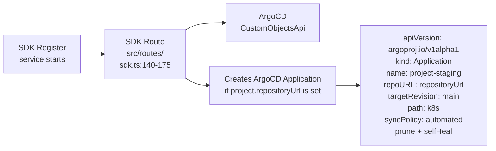
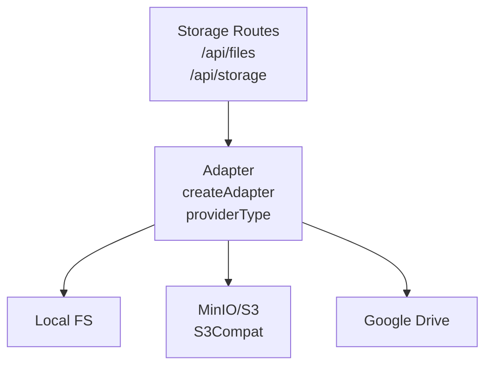

# Data Flow — Request Lifecycle

## Complete Request Sequence



## Detailed Flow: Browser → Portal → API

### Step 1: SSL Termination (Nginx Ingress)

```yaml
# Ingress controller: kubernetes/ingress-nginx (host network mode)
# SSL certs managed by cert-manager + Let's Encrypt (letsencrypt-prod ClusterIssuer)

Annotations applied to Ingress resources:
  kubernetes.io/ingress.class: nginx
  cert-manager.io/cluster-issuer: letsencrypt-prod  # only for real domains
```

- Wildcard TLS cert: `*.sslip.io` via `spec.tls[0].hosts`
- Internal (sslip.io): bypasses cert-manager, uses self-signed
- Real domains: cert-manager provisions Let's Encrypt certs automatically

### Step 2: Subpath Routing

| Path | Destination | Service | Port |
|------|------------|---------|------|
| `/` | Portal (Angular SPA) | `portal-service` | 80 |
| `/api` | Platform API | `api-service` | 3000 |
| `/grafana` | Grafana dashboards | `grafana-service` | 3001 |
| `/argocd` | ArgoCD UI | `argocd-server` | 443 |
| `/portainer` | Portainer | `portainer-service` | 9000 |

### Step 3: API → PostgreSQL (TypeORM Entities)



- Singleton `DataSource` initialized in `config/database.ts` with `synchronize: true`
- Entity relations: `User → Role`, `Project → Environment → Deployment`, `Secret → SecretVersion`
- Connection: `POSTGRES_HOST`, `POSTGRES_PORT`, `POSTGRES_USER`, `POSTGRES_PASSWORD`, `POSTGRES_DB`

Example from `server.ts`:
```typescript
const ds = await getDb();
const userRepo = ds.getRepository(User);
const user = await userRepo.findOne({ where: { email } });
```

### Step 4: API → MongoDB (Logs/Metrics/Events)



- Non-blocking: MongoDB connect failure does not crash API (warning logged)
- Mongoose schemas in `src/schemas/` — `Log.ts`, `ApiMetric.ts`, `BugReport.ts`, `MetricsRaw.ts`, etc.

Log ingestion (`POST /api/sdk/logs`):
```typescript
await LogModel.insertMany(resolvedLogs);       // MongoDB
await forwardToLoki(resolvedLogs);             // Loki (parallel)
```
Error tracking (upsert by projectId + errorType + stackHash):
```typescript
await ErrorDocModel.findOneAndUpdate(query, { $inc: { occurrenceCount: 1 } }, { upsert: true });
```

### Step 5: API → Redis (Caching/Pub-Sub)



The `config/connections.ts` provides `RedisConnection` class with `get/set/healthCheck` methods, but the API primarily uses an **in-memory permission cache** (`Map<userId, { permissions: Set<string>, expiresAt: number }>`) rather than Redis, to avoid network latency on every request.

### Step 6: SDK → API Telemetry Flow



SDK token authentication (`src/middleware/auth.ts`):
```typescript
// Two token formats supported:
// 1. "sdk-{projectId}:{secret}"  — lightweight, inline project ID
// 2. "sdk_live_{uuid}"           — full SdkCredential lookup in PostgreSQL
```

### Step 7: API → ArgoCD (GitOps Sync)



### Step 8: API → MinIO/S3 (File Storage)



Adapter selection (`src/lib/storage-service.ts`):
```typescript
function createAdapter(providerType, credentials, bucketName?, endpointUrl?): StorageAdapter
  - 'google_drive' → GoogleDriveAdapter (OAuth2 refresh token)
  - 's3'           → S3Adapter (AWS SDK v3)
  - 'minio'        → S3Adapter (endpoint forced to minio:9000)
  - default        → LocalAdapter (./storage directory)
```

## Asynchronous Processing

| Operation | Trigger | Execution | Error Handling |
|-----------|---------|-----------|---------------|
| Bug report → ClickUp | `POST /api/sdk/bug-report` | Fire-and-forget `(async () => { ... })()` | Silent catch |
| Log enrichment (ErrorDoc) | `POST /api/sdk/logs` | Inline after LogModel.insertMany | Silent catch |
| ArgoCD Application create | `POST /api/sdk/register` | Inline with retry (create → replace) | Silent catch |
| K8s resources create | `POST /api/sdk/register` | Inline (create → replace fallback) | Silent catch |
| DB auto-provision | `POST /api/sdk/register` | Inline via `provisionPostgresDb()` | Silent catch |
| Preview env decay | Scheduler (startup) | `setInterval` checking 72h threshold | Logged |

## Error Response Format

All API errors follow a consistent envelope:
```json
{
  "error": "User email not found. Run init-demo first.",
  "required": ["secrets.reveal"]  // only for 403 permission failures
}
```

HTTP Status Codes:
| Code | Meaning | Source |
|------|---------|--------|
| 200 | Success | All routes |
| 201 | Created | POST routes |
| 400 | Bad request | Validation failures |
| 401 | Unauthorized | Missing/invalid JWT or SDK token |
| 403 | Forbidden | Insufficient RBAC permissions |
| 404 | Not found | Entity not found |
| 409 | Conflict | Duplicate email/role name |
| 500 | Server error | Encryption key missing, internal failure |
