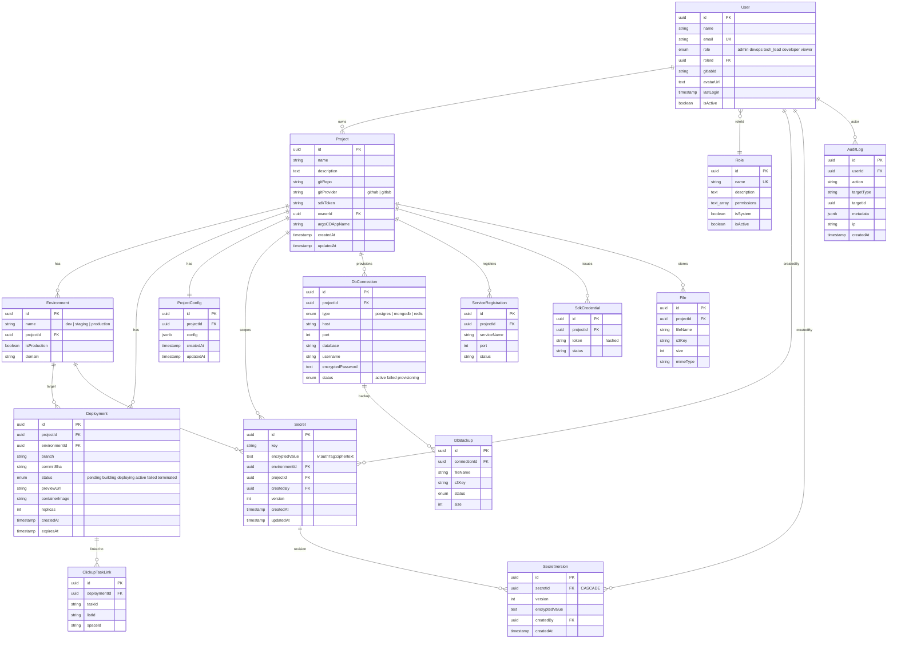

# Database Schema

Platform uses PostgreSQL as its primary database with TypeORM for entity management and schema synchronization.

## Entity Relationship Diagram

## Entity Definitions

### User (`users`)

| Column | Type | Description |
|---|---|---|
| id | UUID (PK) | Primary key |
| name | VARCHAR(255) | Display name |
| email | VARCHAR(255) | Login email (unique) |
| role | ENUM | Role preset: admin, devops, tech_lead, developer, viewer |
| roleId | UUID (FK→roles) | Optional custom role reference |
| gitlabId | VARCHAR(255) | GitLab account ID for OAuth |
| avatarUrl | TEXT | Profile picture URL |
| lastLogin | TIMESTAMP | Last successful login |
| isActive | BOOLEAN | Soft-delete flag |

### Role (`roles`)

| Column | Type | Description |
|---|---|---|
| id | UUID (PK) | Primary key |
| name | VARCHAR(100) | Role name (unique) |
| description | TEXT | Human-readable description |
| permissions | TEXT[] | Array of permission strings |
| isSystem | BOOLEAN | System roles cannot be modified/deleted |
| isActive | BOOLEAN | Whether role is active |

### Project (`projects`)

| Column | Type | Description |
|---|---|---|
| id | UUID (PK) | Primary key |
| name | VARCHAR(255) | Project name |
| description | TEXT | Project description |
| gitRepo | VARCHAR(500) | Git repository URL |
| gitProvider | VARCHAR(50) | github / gitlab |
| sdkToken | VARCHAR(255) | Auto-generated SDK token |
| ownerId | UUID (FK→users) | Project owner |
| argoCDAppName | VARCHAR(255) | ArgoCD application name |
| createdAt | TIMESTAMP | Creation timestamp |
| updatedAt | TIMESTAMP | Last update timestamp |

### Environment (`environments`)

| Column | Type | Description |
|---|---|---|
| id | UUID (PK) | Primary key |
| name | VARCHAR(100) | dev / staging / production |
| projectId | UUID (FK→projects) | Parent project |
| isProduction | BOOLEAN | Production flag (affects protection rules) |
| domain | VARCHAR(500) | Custom domain for this environment |

### Deployment (`deployments`)

| Column | Type | Description |
|---|---|---|
| id | UUID (PK) | Primary key |
| projectId | UUID (FK→projects) | Parent project |
| environmentId | UUID (FK→environments) | Target environment |
| branch | VARCHAR(255) | Git branch name |
| commitSha | VARCHAR(40) | Git commit hash |
| status | ENUM | pending / building / deploying / active / failed / terminated |
| previewUrl | VARCHAR(500) | Preview environment URL |
| containerImage | VARCHAR(500) | Docker image reference |
| replicas | INTEGER | Pod replica count |
| createdAt | TIMESTAMP | Creation timestamp |
| expiresAt | TIMESTAMP | Preview expiry (72h TTL) |

### Secret (`secrets`)

| Column | Type | Description |
|---|---|---|
| id | UUID (PK) | Primary key |
| key | VARCHAR(255) | Secret key name |
| encryptedValue | TEXT | AES-256-GCM ciphertext (format: `iv:authTag:ciphertext`) |
| environmentId | UUID (FK→environments) | Environment scope (nullable = all) |
| projectId | UUID (FK→projects) | Parent project |
| createdBy | UUID (FK→users) | Creator |
| version | INTEGER | Current version number |
| createdAt | TIMESTAMP | Creation timestamp |
| updatedAt | TIMESTAMP | Last update timestamp |

### SecretVersion (`secret_versions`)

| Column | Type | Description |
|---|---|---|
| id | UUID (PK) | Primary key |
| secretId | UUID (FK→secrets, CASCADE) | Parent secret |
| version | INTEGER | Version number |
| encryptedValue | TEXT | Encrypted value at this version |
| createdBy | UUID (FK→users) | Who created this version |
| createdAt | TIMESTAMP | Creation timestamp |

### DbConnection (`db_connections`)

| Column | Type | Description |
|---|---|---|
| id | UUID (PK) | Primary key |
| projectId | UUID (FK→projects) | Parent project |
| type | ENUM | postgres / mongodb / redis |
| name | VARCHAR(255) | Connection name |
| host | VARCHAR(500) | Database host |
| port | INTEGER | Database port |
| database | VARCHAR(255) | Database name |
| username | VARCHAR(255) | Database user |
| encryptedPassword | TEXT | Encrypted password |
| status | ENUM | active / failed / provisioning |

### AuditLog (`audit_logs`)

| Column | Type | Description |
|---|---|---|
| id | UUID (PK) | Primary key |
| userId | UUID (FK→users) | Actor |
| action | VARCHAR(100) | Action identifier (e.g., `user.created`, `secret.read`) |
| targetType | VARCHAR(50) | Entity type |
| targetId | UUID | Entity ID |
| metadata | JSONB | Additional context |
| ip | VARCHAR(45) | Client IP |
| createdAt | TIMESTAMP | Creation timestamp |

### Other Entities

| Entity | Table | Key Columns |
|---|---|---|
| ServiceRegistration | `service_registrations` | projectId, serviceName, port, status |
| File | `files` | projectId, fileName, s3Key, size, mimeType |
| Alert | `alerts` | projectId, metric, condition, threshold, enabled |
| DbBackup | `db_backups` | connectionId, fileName, s3Key, status, size |
| SmtpConfig | `smtp_configs` | host, port, user, encryptedPass, fromEmail |
| StorageProvider | `storage_providers` | endpoint, bucket, accessKey, encryptedSecretKey |
| ClickupTaskLink | `clickup_task_links` | deploymentId, taskId, listId, spaceId |
| SdkCredential | `sdk_credentials` | projectId, token (hashed), status |

## MongoDB Collections

Platform also uses MongoDB (via Mongoose) for high-volume, ephemeral data:

| Collection | Schema | Purpose |
|---|---|---|
| logs | Log | Application logs forwarded by SDKs |
| api_metrics | ApiMetric | Per-route latency records (p50/p95/p99) |
| bug_reports | BugReport | User-submitted bug reports with screenshots |
| error_docs | ErrorDoc | Aggregated error documentation |
| sdk_events | SdkEvent | SDK lifecycle events (register, heartbeat, etc.) |
| metrics_raw | MetricsRaw | Raw metric data points |
| feature_flags | FeatureFlag | Feature flag configurations |

## Key Relationships

- **User → Role**: Many-to-One (via `roleId`, optional)
- **Project → User**: Many-to-One (via `ownerId`)
- **Project → Environment**: One-to-Many
- **Project → Deployment**: One-to-Many
- **Environment → Deployment**: One-to-Many
- **Project → Secret**: One-to-Many
- **Secret → SecretVersion**: One-to-Many (CASCADE delete)
- **Project → DbConnection**: One-to-Many
- **Deployment → ClickupTaskLink**: One-to-Many

## Synchronization

TypeORM `synchronize: true` is enabled in development, which automatically creates/updates tables on application startup. In production, use migrations instead.
